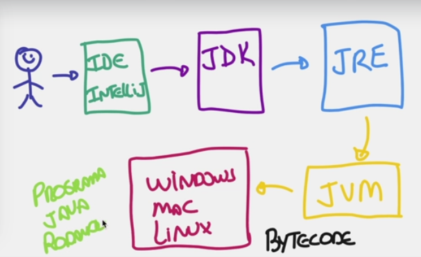

# JAVA

### Downloads:



#### Guia:



### Conceitos

###

* Java - Linguagem de programação orientada a objetos&#x20;

* JVM - Java Virtual Machine -> cria-se uma máquina virtual para que o código seja rodado dentro dessa máquina que traduz o código para o sistema operacional que está sendo utilizado. Além disso após instalar o JDK, ele já funciona.

* Quando instala o JDK ele vem com tudo o que é necessário para o código rodar.

* JRE - onde se compila tudo, onde o código vira um programa

* Para ser executado, é necessário a JVM para o código ser executado no sistema -> BYTECODE(conversão do código para a máquina)

* Java é uma linguagem compilada e interpretada ja que a JVM, mais especificamente, o compilador javac compila gerando bytecodes e depois os interpreta de acordo com o sistema operacional

\-> para saber a diferença de linguagem compilada e interpretada:



<figure><figcaption></figcaption></figure>

#### Edições

* Java SE - versão mais básica do java, onde a programação acontece
* Java EE - edição mais avançada, utilizada pelas grandes empresas, empresas financeiras, onde se controla o software interno, versão server
* Java ME - utilizada em dispositivos menores, como android, com alguns componentes para estrutura mobile que requer menos processamento
* Java FX - aplicações para desktop -> exemplo - criar uma calculadora para o desktop

#### Para entender melhor:



### Como Java funciona
